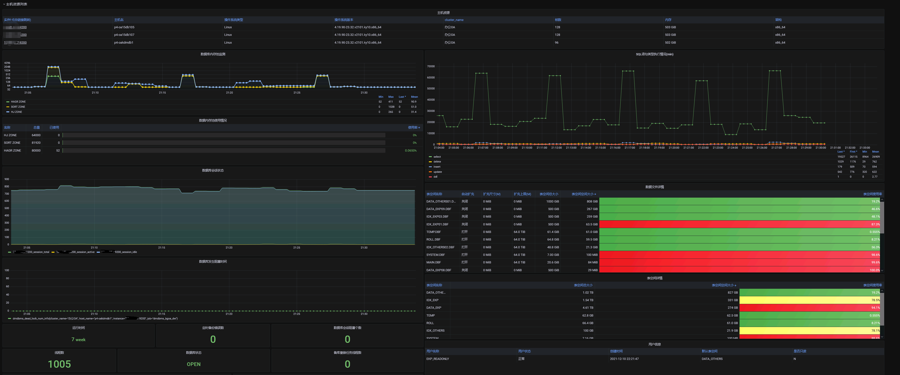
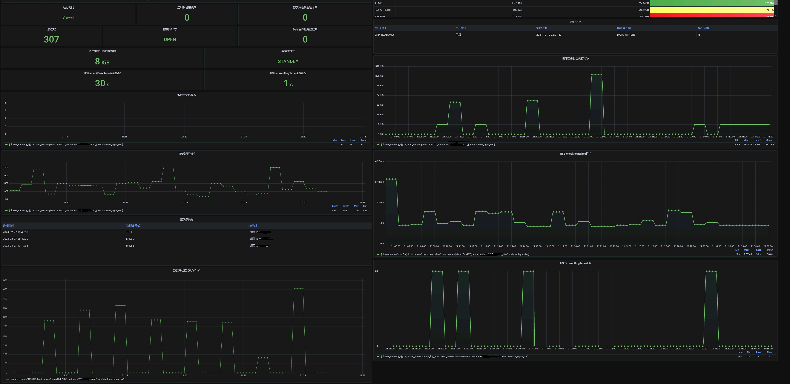
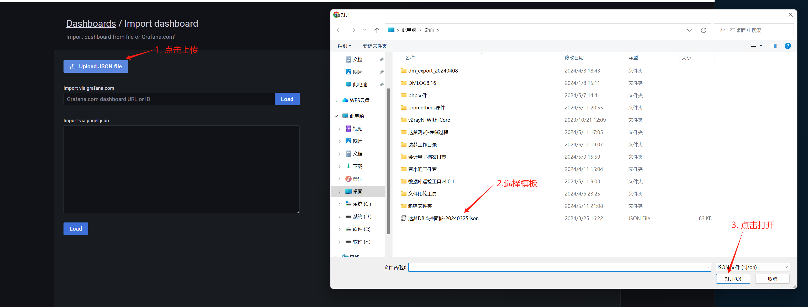
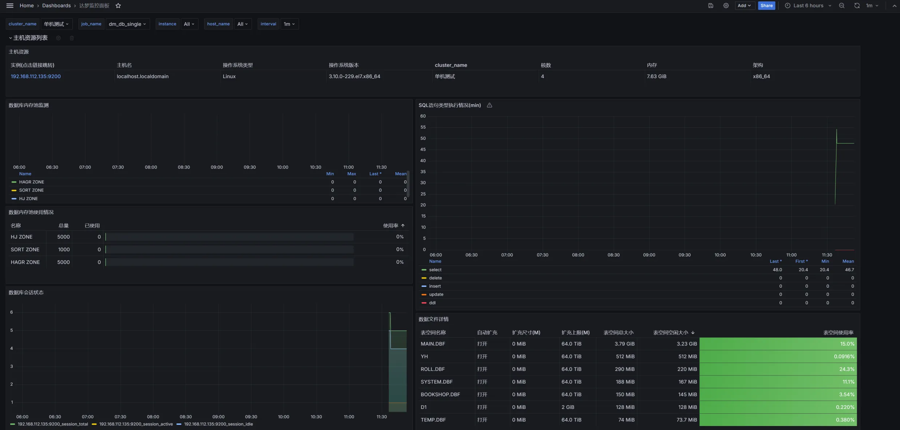

<h1 align="center">DAMENG_EXPORTER的介绍说明</h1>

# 介绍
1. DM数据库适配prometheus监控的采集器，目前已支持DM8数据库同时提供grafana 8.5.X 以上版本的监控面板（其他的grafana版本需要自己绘制表盘）。
2. 已支持的指标如下
```
   数据库线程数	dmdbms_thread_num_info
   数据库事务等待数	dmdbms_trx_info
   数据库死锁数	dmdbms_dead_lock_num_info
   数据库的状态	dmdbms_status_info
   数据库启动时间	dmdbms_start_time_info
   主备集群同步延迟	dmdbms_rapply_stat
   表空间总大小	dmdbms_tablespace_size_total_info
   表空间空闲大小	dmdbms_tablespace_size_free_info
   表空间数据文件总大小	dmdbms_tablespace_file_total_info
   表空间数据文件空闲大小	dmdbms_tablespace_file_free_info
   数据库会话数状态	dmdbms_session_type_info
   数据库实例的错误事件	dmdbms_instance_log_error_info
   查询内存池的当前使用状态	dmdbms_memory_curr_pool_info
   查询内存池的配置上限	dmdbms_memory_total_pool_info
   数据库授权查询	dmdbms_license_date
   数据库定时任务错误	dmdbms_joblog_error_num
   监控监视器进程	dmdbms_monitor_info
   监控慢SQL语句	dmdbms_slow_sql_info
   备库重演运行线程数	dmdbms_rapply_sys_task_num
   备库重演内存堆积信息	dmdbms_rapply_sys_task_mem_used
   数据库语句类型数量展示逻辑(tps qps的指标)	dmdbms_statement_type_info
   检查点更新	dmdbms_ckpttime_info
   检查用户信息	dmdbms_user_list_info
   数据库版本	dmdbms_version
   数据库启动天数	dmdbms_start_day
   数据库归档状态	dmdbms_arch_status
   dmap进程探活	dmdbms_dmap_process_is_exit
   dmserver进程探活	dmdbms_dmserver_process_is_exit
   dmwatcher进程探活	dmdbms_dmwatcher_process_is_exit
   dmmonitor进程探活	dmdbms_dmmonitor_process_is_exit
   dmagent进程探活	dmdbms_dmagent_process_is_exit
```
3. 如果有问题，欢迎提issue。如该项目对您有用请点亮右上角的starred
# 目录
- doc目录存放的是相关的配置文件（告警模板、配置模板、表盘）
- collector存放的是各个指标的采集逻辑
- build_all_versions.bat为window的一键编译脚本

# 参数
```
# 每个版本存在差异,以每个版本实际结果为准
[root@VM-24-16-centos opt]# ./dameng_exporter_v1.0.8_linux_amd64 --help
usage: dameng_exporter_v1.0.8_linux_amd64 [<flags>]


Flags:
  --[no-]help                   Show context-sensitive help (also try --help-long and --help-man).
  --configFile="./dameng_exporter.config"  
                                Path to configuration file
  --listenAddress=":9200"       Address to listen on
  --metricPath="/metrics"       Path for metrics
  --dbHost="127.0.0.1:5236"     Database Host
  --dbUser="SYSDBA"             Database user
  --dbPwd="SYSDBA"              Database password
  --queryTimeout=30             Timeout for queries (Second)
  --maxOpenConns=10             Maximum open connections (number)
  --maxIdleConns=1              Maximum idle connections (number)
  --connMaxLifetime=30          Connection maximum lifetime (Minute)
  --[no-]checkSlowSqL           Check slow SQL,default:false
  --slowSqLTime=10000           Slow SQL time (Millisecond)
  --SlowSqlLimitRows=10         Slow SQL return limit row
  --[no-]registerHostMetrics    Register host metrics,default:true
  --[no-]registerDatabaseMetrics Register database metrics,default:true
  --[no-]registerDmhsMetrics    Register dmhs metrics,default:false
  --[no-]registerCustomMetrics  Register custom metrics,default:true
  --bigKeyDataCacheTime=60      Big key data cache time (Minute)
  --alarmKeyCacheTime=60        Alarm key cache time (Minute)
  --logMaxSize=10               Maximum log file size(MB)
  --logMaxBackups=3             Maximum log file backups (number)
  --logMaxAge=30                Maximum log file age (Day)
  --encryptPwd=""               Password to encrypt and exit
  --[no-]encodeConfigPwd        Encode the password in the config file,default:true
```
# 搭建效果图

<br />

<br />

<br />

# docker镜像拉取
```shell
## linux amd64版本
## 拉取镜像
docker pull registry.cn-hangzhou.aliyuncs.com/dameng_exporter/dameng_exporter:v1.0.7_amd64
## 更换别名
docker tag registry.cn-hangzhou.aliyuncs.com/dameng_exporter/dameng_exporter:v1.0.7_amd64 dameng_exporter:v1.0.7_amd64
## 启动
docker run -d --name dameng_exporter_amd64 -p 9200:9200 dameng_exporter:v1.0.7_amd64 --dbHost="ip地址:端口(192.168.121.001:5236)" --dbUser="SYSDBA" --dbPwd="数据库密码(SYSDBA)"


## linux arm64版本
## 拉取镜像
docker pull registry.cn-hangzhou.aliyuncs.com/dameng_exporter/dameng_exporter:v1.0.7_arm64
## 更换别名
docker tag registry.cn-hangzhou.aliyuncs.com/dameng_exporter/dameng_exporter:v1.0.7_arm64 dameng_exporter:v1.0.7_arm64
## 启动
docker run -d --name dameng_exporter_arm64 -p 9200:9200 dameng_exporter:v1.0.7_arm64 --dbHost="ip地址:端口(192.168.121.001:5236)" --dbUser="SYSDBA" --dbPwd="数据库密码(SYSDBA)"
```


# 搭建步骤
可以参考如下连接

1）https://blog.csdn.net/qq_35349982/article/details/140700625

2）https://blog.csdn.net/qq_35349982/article/details/144426840

## 1. 下载已经编译好的exporter包
https://github.com/gaoyuan98/dameng_exporter/releases
```
// 根据需要安装的平台下载已经编译好的包
dameng_exporter_v1.X_linux_amd64.tar.gz（linux_x86平台）
dameng_exporter_v1.X_linux_arm64.tar.gz（linux_arm平台）
dameng_exporter_v1.X_windows_amd64.tar.gz（window_x64平台）
```

## 2. 新建用户权限
```sql
## 新建用户
create tablespace "PROMETHEUS.DBF" datafile 'PROMETHEUS.DBF' size 512 CACHE = NORMAL;
create user "PROMETHEUS" identified by "PROMETHEUS";
alter user "PROMETHEUS" default tablespace "PROMETHEUS.DBF" default index tablespace "PROMETHEUS.DBF";
## 条件允许的话 最好赋予DBA权限(避免后期因升级exporter版本而导致查询权限不足)
grant "PUBLIC","RESOURCE","SOI","SVI","VTI" to "PROMETHEUS";
## 最小化权限
GRANT SELECT ON V$SYSSTAT TO PROMETHEUS;
GRANT SELECT ON V$SESSIONS TO PROMETHEUS;
GRANT SELECT ON V$LICENSE TO PROMETHEUS;
GRANT SELECT ON V$DATABASE TO PROMETHEUS;
GRANT SELECT ON V$DM_INI TO PROMETHEUS;
GRANT SELECT ON V$RLOGFILE TO PROMETHEUS;
GRANT SELECT ON V$TABLESPACE TO PROMETHEUS;
GRANT SELECT ON V$DATAFILE TO PROMETHEUS;
GRANT SELECT ON DBA_DATA_FILES TO PROMETHEUS;
GRANT SELECT ON DBA_FREE_SPACE TO PROMETHEUS;
GRANT SELECT ON V$TRXWAIT TO PROMETHEUS;
GRANT SELECT ON V$CKPT TO PROMETHEUS;
GRANT SELECT ON V$RAPPLY_SYS TO PROMETHEUS;
GRANT SELECT ON V$PROCESS TO PROMETHEUS;
GRANT SELECT ON V$LOCK TO PROMETHEUS;
GRANT SELECT ON V$THREADS TO PROMETHEUS;
```
## 3. 在数据库上运行
1. 解压压缩包
2. 修改dameng_exporter.config配置文件的数据库账号及密码
注意：程序运行后会自动对数据库密码部分进行密文处理，不用担心密码泄露问题
3. 启动exporter程序
```
# 启动程序

## 1） 第一种方式：直接启动
## 直接启动exporter程序后缀不跟参数,此时会自动使用同级目录下dameng_exporter.config配置文件的数据库账号及密码
[root@VM-24-17-centos dm_prometheus]#  nohup ./dameng_exporter_v1.0.0_linux_amd64 > /dev/null 2>&1 &

## 2) 第二种方式：添加参数形式启动  ./dameng_exporter_arm64 --help可以查看参数
[root@VM-24-17-centos dm_prometheus]#  nohup ./dameng_exporter_arm64 --listenAddress=":9200" --dbHost="ip地址:端口(192.168.121.001:5236)" --dbUser="SYSDBA" --dbPwd="数据库密码(SYSDBA)"

# 通过浏览器访问http://被监控端IP:9200/metrics
[root@server ~]# lsof -i:9200
```
## 4. 在prometheus上进行配置
修改prometheus的prometheus.yml配置文件
```
# 添加的是数据库监控的接口9200接口，如果是一套集群，则在targets标签后进行逗号拼接，如下图所示
# 注意 cluster_name标签名不能改，标签的值可以改，提供的模板用该标签做分类
# 每套集群的job_name和cluster_name的值需要保证全局唯一

# 单机示例
- job_name: "dm_db_single"
  static_configs:
   - targets: ["192.168.112.135:9200"]
     labels:
     cluster_name: '单机测试'
     
# 集群示例
- job_name: "dmdbms_bgoak_dw"
 static_configs:
   - targets: ["192.168.112.135:9200","192.168.112.136:9200"]
     labels:
       cluster_name: 'OA集群DW'     
```
<br />


## 5. 在grafana上导入提供的表盘
> 表盘模板在doc目录下
1. 登录grafana登录，导入模板 
   <br />
   
2. 所使用的模板在表盘中
   <br />
   

3. 效果图
   <br />
   

# 6. 自定义指标
在exporter的同级目录下创建一个custom_metrics.toml文件，注意文件权限,编写SQL即可。写法与(oracledb_exporter)类似

## 1. 简单语句
```
[[metric]]
context = "context_with_labels"
request = "SELECT 1 as value_1, 2 as value_2, 'First label' as label_1, 'Second label' as label_2 FROM DUAL"
metricsdesc = { value_1 = "Simple example returning always 1 as counter.", value_2 = "Same but returning always 2 as gauge." }
```
该文件在导出器中生成以下条目：
```
# HELP dmdbms_context_no_label_value_1 Simple example returning always 1.
# TYPE dmdbms_context_no_label_value_1 gauge
dmdbms_context_no_label_value_1{host_name="gy"} 1
# HELP dmdbms_context_no_label_value_2 Same but returning always 2.
# TYPE dmdbms_context_no_label_value_2 gauge
dmdbms_context_no_label_value_2{host_name="gy"} 2
```
## 2. 自定义指标的lable
自定义标签的例子:
```
[[metric]]
context = "context_with_labels"
labels = [ "label_1", "label_2" ]
request = "SELECT 1 as value_1, 2 as value_2, 'First label' as label_1, 'Second label' as label_2 FROM DUAL"
metricsdesc = { value_1 = "Simple example returning always 1 as counter.", value_2 = "Same but returning always 2 as gauge." }
# Can be counter or gauge (default)
metricstype = { value_1 = "counter" }
```
该文件在导出器中生成以下条目：
```
# HELP dmdbms_context_with_labels_value_1 Simple example returning always 1 as counter.
# TYPE dmdbms_context_with_labels_value_1 counter
dmdbms_context_with_labels_value_1{host_name="gy",label_1="First label",label_2="Second label"} 1
# HELP dmdbms_context_with_labels_value_2 Same but returning always 2 as gauge.
# TYPE dmdbms_context_with_labels_value_2 gauge
dmdbms_context_with_labels_value_2{host_name="gy",label_1="First label",label_2="Second label"} 2
```
## 3.查询表空间数据文件的大小
```
[[metric]]
context = "test_table_metrics"
labels = [ "name"]
request = "SELECT name,TO_CHAR(TOTAL_SIZE*PAGE/1024/1024) AS total_size_mb FROM SYS.V$TABLESPACE"
metricsdesc = { total_size_mb = "Simple example"}
```
该文件在导出器中生成以下条目：
```
# HELP dmdbms_test_table_metrics_total_size_mb Simple example
# TYPE dmdbms_test_table_metrics_total_size_mb gauge
dmdbms_test_table_metrics_total_size_mb{host_name="gy",name="DMEAGLE"} 1024
dmdbms_test_table_metrics_total_size_mb{host_name="gy",name="DMEAGLE_DEV"} 1024
dmdbms_test_table_metrics_total_size_mb{host_name="gy",name="MAIN"} 2176
dmdbms_test_table_metrics_total_size_mb{host_name="gy",name="ROLL"} 128
dmdbms_test_table_metrics_total_size_mb{host_name="gy",name="SYSTEM"} 138
dmdbms_test_table_metrics_total_size_mb{host_name="gy",name="TEMP"} 74
```
# 微信公众号
扫码或微信公众号搜索“小高的影子”分享DM数据库一线遇到的各类问题
<br />

<br />
# 更新记录
## v1.0.8
1. 修复在window环境下运行时报unknown time zone “Asia/Shanghai”的问题
2. 调整程序启动时的参数驼峰法命名，--help可查看
## 20241212
1. 新增全局报警的表盘以及对应的rules
## v1.0.7
1. 修复custom_metrics.toml不支持多个自定义指标的问题
## 20241119
1. docker介质新增amd64以及arm64的版本
2. 修正文档中的tps qps指标，实际使用的是dmdbms_statement_type_info指标
## 20241117
1. 新增docker镜像(阿里云+docker Hub)
   https://hub.docker.com/r/gaoyuan98/dameng_exporter
## v1.0.6
1. 修复指标dmdbms_start_time_info时间戳与实际时间相差14个小时问题
## v1.0.5
1. 修复表空间指标dmdbms_tablespace_size   total与free指标 赋值错误的问题
2. 优化查询指定版本时 因没有指定视图而提示的告警信息
## v1.0.4
1. 修复自定义SQL指标时，多条数据报lable重复的问题
2. 将依赖的go驱动调整为v1.3.162版本
3. 修复告警的rules中表空间告警规则不生效的问题
## v1.0.3
1. 修复自定义SQL指标时指标名称不包含context的问题
2. 优化logger的日志展示,日志级别带颜色输出
## v1.0.2
1. 新增自定义SQL指标的功能（在exporter的同级目录下创建一个custom_metrics.toml文件即可，写法与（oracledb_exporter相同）
