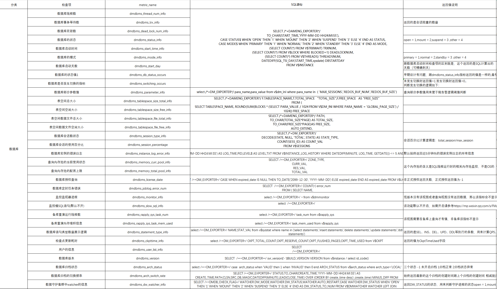
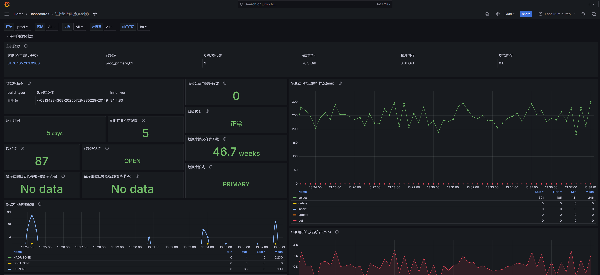
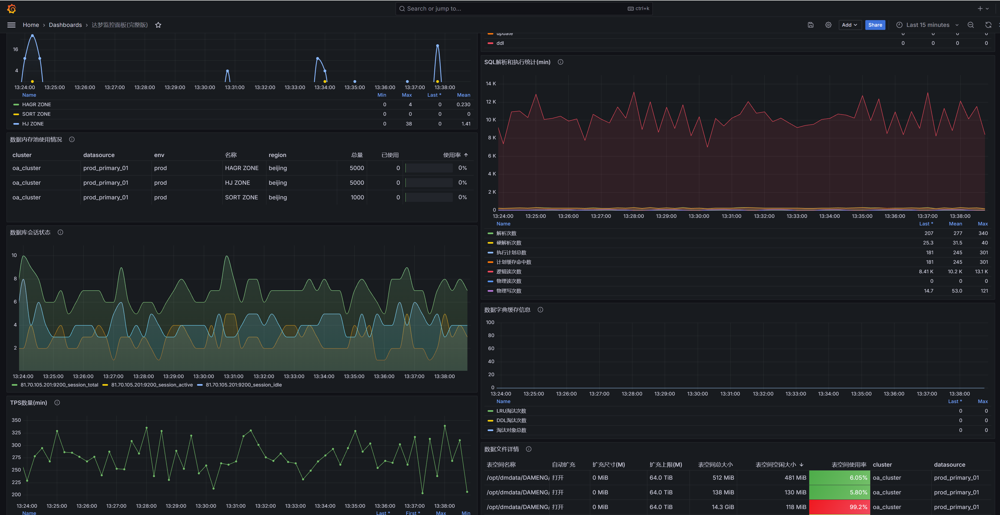
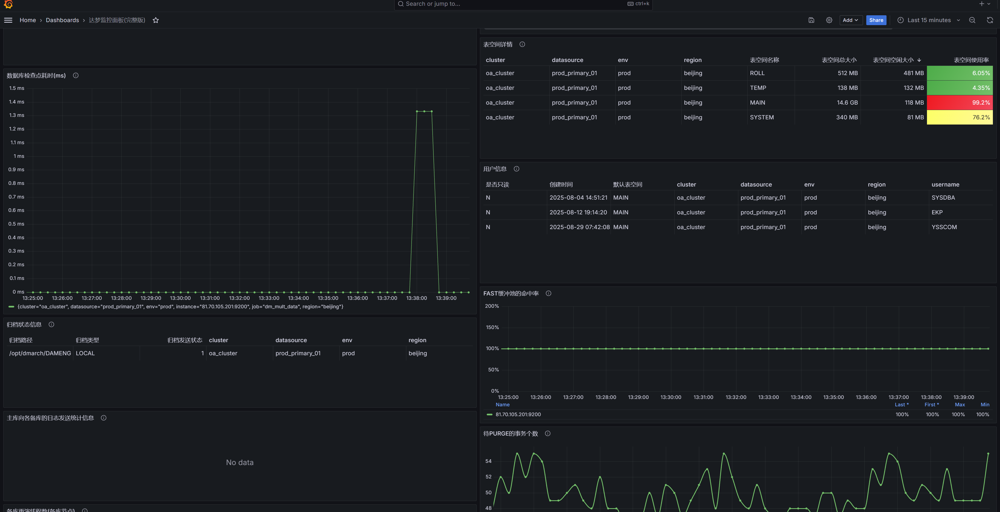
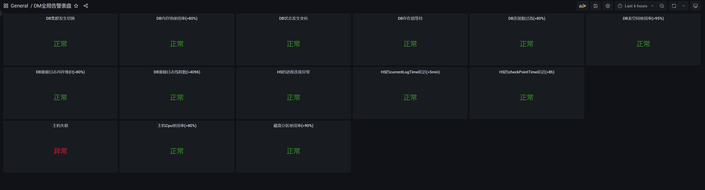
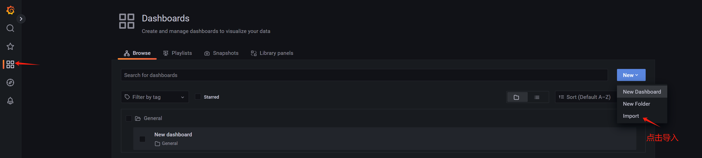

<h1 align="center">Dameng Exporter - 达梦数据库 Prometheus 监控采集器</h1>

> ⚠️ **重要提示：v1.2.0+ 采用全新多数据源架构，与 v1.1.6 及更早版本不兼容。[查看版本兼容性说明](#版本兼容性说明)**

<p align="center">
  <!-- 项目统计 -->
  
  
  
</p>

<p align="center">
  <!-- 版本和下载 -->
  
  
  
  
  <!-- Docker 统计 -->
  
  
</p>

<p align="center">
  <!-- 技术栈 -->
  
  
  
  
  
</p>

## 📖 简介

Dameng Exporter 是一个专为达梦数据库（DM8）设计的 Prometheus 监控数据采集器，提供全面的数据库性能指标采集和监控能力。

### ✨ 核心特性

- 🚀 **多数据源支持** - 支持同时监控多个达梦数据库实例
- 📊 **丰富的监控指标** - 提供 30+ 种数据库性能指标
- 🎨 **Grafana 面板** - 内置专业的 Grafana 8.5+ 监控面板模板
- 🔒 **安全特性** - 支持配置文件中的密码自动加密、Basic Auth 认证
- ⚡ **高性能** - 支持并发采集、智能缓存机制
- 🔧 **灵活配置** - 支持 TOML 配置文件和命令行参数
- 📝 **自定义指标** - 支持通过 SQL 定义自定义监控指标
- 🐳 **容器化部署** - 提供 Docker 镜像，支持 amd64/arm64 架构

### 📊 监控指标概览



> 💡 **获取详细指标文档**：关注微信公众号「达梦课代表」，回复「exporter资料」获取完整的指标实现 SQL 及逻辑说明文档。

## 🗂️ 项目结构

```
dameng_exporter/
├── docs/                         # 文档和配置模板
│   ├── documents/               # 文档文件
│   │   ├── 参数配置指南.md     # 参数详细说明文档
│   │   ├── 自定义指标使用指南.md # 自定义指标使用指南
│   ├── dashboards/              # Grafana 面板模板
│   │   └── *.json               # 监控面板文件
│   ├── alertmanager/            # 告警配置模板
│   └── prometheus_告警规则/      # Prometheus 告警规则
├── collector/                   # 指标采集器实现
├── config/                      # 配置文件目录
├── logs/                        # 日志文件目录
├── scripts/                     # 脚本工具目录
├── dameng_exporter.toml         # 主配置文件
├── custom_queries.metrics       # 自定义指标配置
└── README.md                    # 项目主文档
```

## 🚀 快速开始

### 系统要求

- 达梦数据库 DM8 或以上版本
- Prometheus 2.0+
- Grafana 8.5+（使用提供的面板模板）
- Go 1.23+（从源码编译时需要）

### 下载安装

#### 方式一：下载预编译版本（推荐）

访问 [Releases](https://github.com/gaoyuan98/dameng_exporter/releases) 页面下载对应平台的版本：

```bash
# Linux AMD64
wget https://github.com/gaoyuan98/dameng_exporter/releases/download/v1.2.0/dameng_exporter_v1.2.0_linux_amd64.tar.gz
tar -xzf dameng_exporter_v1.2.0_linux_amd64.tar.gz

# Linux ARM64
wget https://github.com/gaoyuan98/dameng_exporter/releases/download/v1.2.0/dameng_exporter_v1.2.0_linux_arm64.tar.gz
tar -xzf dameng_exporter_v1.2.0_linux_arm64.tar.gz

# Windows AMD64
# 下载 dameng_exporter_v1.2.0_windows_amd64.tar.gz 并解压
```

#### 方式二：Docker 部署

```bash
# 拉取镜像（自动匹配系统架构）
docker pull gaoyuan98/dameng_exporter:latest  # 拉取最新版本
# docker pull gaoyuan98/dameng_exporter:v1.2.0  # 拉取指定版本

# 如果遇到拉取失败，尝试以下方法：
# 1. 使用完整路径
docker pull docker.io/gaoyuan98/dameng_exporter:latest

# 2. 使用国内镜像加速（腾讯云为例）
# 先配置镜像加速器：sudo vim /etc/docker/daemon.json
# 添加: {"registry-mirrors": ["https://mirror.ccs.tencentyun.com"]}
# 重启: sudo systemctl restart docker

# 运行容器
docker run -d --name dameng_exporter \
  -p 9200:9200 \
  gaoyuan98/dameng_exporter:latest \
  --dbHost="192.168.1.100:5236" \
  --dbUser="SYSDBA" \
  --dbPwd="YourPassword"

# 查看所有镜像标签
# Docker Hub: https://hub.docker.com/r/gaoyuan98/dameng_exporter/tags
```

#### 方式三：从源码编译

```bash
# 克隆项目
git clone https://github.com/gaoyuan98/dameng_exporter.git
cd dameng_exporter

# 编译（自动下载依赖）
go build -o dameng_exporter main.go

# Windows 一键编译
./scripts/build_all_versions.bat
```

## 📈 监控效果展示

### Grafana 面板效果


<br />

<br />

<br />


## 📦 部署指南

### 步骤 1：准备数据库用户

在达梦数据库中创建专用监控用户并授权：
```sql
-- 创建表空间和用户（可以使用任意用户名，这里以 MONITOR_USER 为例）
CREATE TABLESPACE "MONITOR_TS" DATAFILE 'MONITOR_TS.DBF' SIZE 512 CACHE = NORMAL;
CREATE USER "MONITOR_USER" IDENTIFIED BY "YourPassword123";
ALTER USER "MONITOR_USER" DEFAULT TABLESPACE "MONITOR_TS" DEFAULT INDEX TABLESPACE "MONITOR_TS";

-- 推荐：授予 DBA 权限（简化权限管理）
GRANT DBA TO "MONITOR_USER";

-- 或者：最小权限授予（生产环境推荐）
GRANT "PUBLIC","RESOURCE","SOI","SVI","VTI" TO "MONITOR_USER";
-- 授予必要的系统视图查询权限
GRANT SELECT ON V$SYSSTAT TO MONITOR_USER;
GRANT SELECT ON V$SESSIONS TO MONITOR_USER;
GRANT SELECT ON V$LICENSE TO MONITOR_USER;
GRANT SELECT ON V$DATABASE TO MONITOR_USER;
GRANT SELECT ON V$DM_INI TO MONITOR_USER;
GRANT SELECT ON V$RLOGFILE TO MONITOR_USER;
GRANT SELECT ON V$TABLESPACE TO MONITOR_USER;
GRANT SELECT ON V$DATAFILE TO MONITOR_USER;
GRANT SELECT ON DBA_DATA_FILES TO MONITOR_USER;
GRANT SELECT ON DBA_FREE_SPACE TO MONITOR_USER;
GRANT SELECT ON V$TRXWAIT TO MONITOR_USER;
GRANT SELECT ON V$CKPT TO MONITOR_USER;
GRANT SELECT ON V$RAPPLY_SYS TO MONITOR_USER;
GRANT SELECT ON V$RAPPLY_STAT TO MONITOR_USER;
GRANT SELECT ON V$PROCESS TO MONITOR_USER;
GRANT SELECT ON V$LOCK TO MONITOR_USER;
GRANT SELECT ON V$THREADS TO MONITOR_USER;
GRANT SELECT ON V$INSTANCE_LOG_HISTORY TO MONITOR_USER;
GRANT SELECT ON V$ARCH_FILE TO MONITOR_USER;
GRANT SELECT ON V$DMWATCHER TO MONITOR_USER;
GRANT SELECT ON V$INSTANCE TO MONITOR_USER;
GRANT SELECT ON V$BUFFERPOOL TO MONITOR_USER;
GRANT SELECT ON V$ARCH_SEND_INFO TO MONITOR_USER;
GRANT SELECT ON V$ARCH_STATUS TO MONITOR_USER;
GRANT SELECT ON V$ARCH_APPLY_INFO TO MONITOR_USER;
GRANT SELECT ON V$PURGE TO MONITOR_USER;
GRANT SELECT ON V$DYNAMIC_TABLES TO MONITOR_USER;
GRANT SELECT ON V$DYNAMIC_TABLE_COLUMNS TO MONITOR_USER;
GRANT SELECT ON V$DB_CACHE  TO MONITOR_USER;
GRANT SELECT ON V$ARCH_QUEUE  TO MONITOR_USER;
```

### 步骤 2：部署 Exporter

#### 选项 A：使用配置文件（推荐）

> 📖 **配置参数详解**：查看 [参数配置指南](https://github.com/gaoyuan98/dameng_exporter/blob/master/docs/documents/参数配置指南.md) 了解所有参数的详细说明和使用示例。

1. 创建配置文件 `dameng_exporter.toml`：

#### 配置示例

```toml
# 单数据源配置
[[datasource]]
name = "dm_prod"
dbHost = "192.168.1.100:5236"
dbUser = "SYSDBA"
dbPwd = "SYSDBA"

# 多数据源配置示例
[[datasource]]
name = "dm_prod"
dbHost = "192.168.1.100:5236"
dbUser = "SYSDBA"
dbPwd = "SYSDBA123"
labels = "env=prod,region=beijing"  # 可选：用于 Grafana 面板过滤

[[datasource]]
name = "dm_test"
dbHost = "192.168.1.101:5236"
dbUser = "TEST_USER"
dbPwd = "TestPassword"
labels = "env=test,region=shanghai"  # 可选：用于 Grafana 面板过滤

# 如需更多配置选项，请参考：docs/documents/参数配置指南.md
```
2. 启动服务：

```bash
# Linux/Unix
nohup ./dameng_exporter --configFile=dameng_exporter.toml > /dev/null 2>&1 &

# Windows
dameng_exporter.exe --configFile=dameng_exporter.toml

# 验证服务
curl http://localhost:9200/metrics
```

#### 选项 B：使用命令行参数

```bash
./dameng_exporter \
  --dbHost="192.168.1.100:5236" \
  --dbUser="MONITOR_USER" \
  --dbPwd="YourPassword123" \
  --listenAddress=":9200" \
  --logLevel="info"
```

#### 选项 C：Docker 部署

```bash
# 使用配置文件方式
docker run -d --name dameng_exporter \
  -p 9200:9200 \
  -v $(pwd)/dameng_exporter.toml:/app/dameng_exporter.toml \
  -v $(pwd)/custom_metrics.toml:/app/custom_metrics.toml \
  gaoyuan98/dameng_exporter:latest

# 使用命令行参数方式
docker run -d --name dameng_exporter \
  -p 9200:9200 \
  gaoyuan98/dameng_exporter:latest \
  --dbHost="192.168.1.100:5236" \
  --dbUser="MONITOR_USER" \
  --dbPwd="YourPassword123"

```

### 步骤 3：配置 Prometheus

编辑 Prometheus 配置文件 `prometheus.yml`：

```yaml
scrape_configs:
  # 单个 Exporter 实例
  - job_name: "dameng_exporter"
    static_configs:
      - targets: ["192.168.1.100:9200"]
  
  # 多个 Exporter 实例（监控不同环境）
  - job_name: "dameng_exporter_multi"
    static_configs:
      - targets: 
        - "192.168.1.100:9200"  # 生产环境 Exporter
        - "192.168.1.101:9200"  # 测试环境 Exporter
```

重载 Prometheus 配置：

```bash
# 发送 SIGHUP 信号
kill -HUP $(pidof prometheus)

# 或使用 API
curl -X POST http://localhost:9090/-/reload
```


### 步骤 4：导入 Grafana 面板

1. 登录 Grafana（默认 http://localhost:3000）
2. 导航到 **Dashboard** → **Import**
3. 上传面板文件：`docs/dashboards/达梦DB监控面板_多标签_20250903.json`
   - 支持多维度标签过滤（datasource、env、region、cluster）
   - 适用于多数据源、多环境监控场景
   - 向后兼容，即使只配置了 datasource 标签也能正常工作
4. 选择 Prometheus 数据源
5. 点击 **Import** 完成导入

> 💡 **多标签版本说明**：
> - **datasource**：数据源标识（必需）
> - **env**：环境标识（如：prod、test、dev）
> - **region**：地域标识（如：beijing、shanghai）
> - **cluster**：集群标识（如：order_cluster、user_cluster）
> - 支持通过 Grafana 变量进行灵活的级联过滤



### 步骤 5：配置告警（可选）

1. 复制告警规则到 Prometheus：

```bash
cp docs/prometheus_告警规则/rules/*.yml /etc/prometheus/rules/
```

2. 配置 AlertManager：

```bash
cp docs/alertmanager/*.yml /etc/alertmanager/
```

3. 重启服务生效

## 🎯 高级功能

### 自定义指标

自定义指标功能允许用户通过 SQL 查询定义专属的监控指标，无需修改源代码。

#### 配置流程

1. 在 `dameng_exporter.toml` 中为目标数据源启用自定义指标并指定配置文件：
   ```toml
   [[datasource]]
   name = "dm_prod"
   dbHost = "192.168.1.100:5236"
   dbUser = "SYSDBA"
   dbPwd = "SYSDBA"
   registerCustomMetrics = true
   customMetricsFile = "./custom_queries.metrics"  # 支持相对/绝对路径
   ```
   `registerCustomMetrics` 默认为 `true`，若显式设置为 `false` 将跳过自定义指标；`customMetricsFile` 必须指向实际存在的 `.metrics`、`.sql.toml` 或 `.queries.toml` 文件。
2. 在 `custom_queries.metrics` 中新增一个或多个 `[[metric]]` 区块以定义 SQL 查询。
3. 保存文件后重新启动 Exporter（或重新部署容器），日志中出现 `loaded X custom metric(s)` 表示加载成功。

#### 指标定义模板

```toml
# custom_queries.metrics
[[metric]]
context = "tablespace_usage"
labels = ["tablespace_name"]
request = """
SELECT name AS tablespace_name,
       TOTAL_SIZE * PAGE / 1024 / 1024 / 1024 AS size_gb
FROM   SYS.V$TABLESPACE
"""
metricsdesc = { size_gb = "Tablespace size in GB" }
metricstype = { size_gb = "gauge" }
# ignorezeroresult = true  # 可选：为 true 时忽略数值为 0 的样本
```

- `context` 用于生成最终的指标前缀 `dmdbms_<context>_<字段名>`。
- `labels` 定义会作为 Prometheus 标签暴露的列，未配置时默认为空数组。
- `request` 需要返回数值列（指标）和可选的标签列，字段名会自动转换为小写。
- `metricsdesc` 与 `metricstype` 必须使用内联表形式（单行），并为每个数值列提供描述及类型（`gauge` 或 `counter`）。
- `ignorezeroresult` 为可选布尔值，设置为 `true` 时会过滤掉值为 0 的结果。

#### 验证与排错

- 执行 `curl http://<exporter-host>:9200/metrics | grep dmdbms_tablespace_usage` 检查指标是否输出。
- 若未看到指标，请确认 SQL 可在数据库中直接执行、字段类型正确，并查看日志是否存在解析或执行错误。

#### 功能特性

- 🔧 通过 SQL 灵活定义指标
- 🏷️ 支持多维度标签
- 📊 支持 Counter 和 Gauge 类型
- 🔄 保存配置并重启后即可生效

> 📖 **详细文档**：查看 [自定义指标使用指南](https://github.com/gaoyuan98/dameng_exporter/blob/master/docs/documents/自定义指标使用指南.md) 了解完整的自定义指标使用指南，包括：
> - 详细参数说明
> - 性能监控、业务指标、安全审计等实用示例
> - 最佳实践和性能优化建议
> - 故障排除和调试技巧

### Basic Auth 认证

保护 metrics 端点免受未授权访问：

#### 1. 生成加密密码

```bash
./dameng_exporter --encryptBasicAuthPwd="YourPassword123"
# 输出: $2a$12$xxxxxxxxxxxxxxxxxxxxxxxxxxxxxxxxxxxxx
```

#### 2. 配置 Exporter

```toml
# dameng_exporter.toml
enableBasicAuth = true
basicAuthUsername = "admin"
basicAuthPassword = "$2a$12$xxxxxxxxxxxxxxxxxxxxxxxxxxxxxxxxxxxxx"  # 使用上面生成的加密密码
```

#### 3. 配置 Prometheus

```yaml
scrape_configs:
  - job_name: "dm_secure"
    static_configs:
      - targets: ["192.168.1.100:9200"]
    basic_auth:
      username: "admin"
      password: "YourPassword123"  # 使用原始密码
```


## 📚 相关资源

### 文档与教程

- [达梦数据库+Prometheus监控适配速览](https://mp.weixin.qq.com/s/CGKakimuFNTQx7epHS6YdA)
- [Prometheus+Grafana基础监控平台搭建](https://mp.weixin.qq.com/s/TL2j3WrwILI9AnG73yPgJg)
- [部署dameng_exporter数据采集组件](https://mp.weixin.qq.com/s/Dca0j4UcIFL4FUxCqkcJ7A)
- [监控项告警配置详解（短信/邮件）](https://mp.weixin.qq.com/s/41m-CS1qOau9vWZId62BUw)
- [解决Prometheus未授权访问漏洞问题](https://mp.weixin.qq.com/s/1wqErvITsrw3hIvYRvSBTQ)
- [配置Basic Auth认证](https://mp.weixin.qq.com/s/zLwQvQXFDM7VWNt4Dk43rQ)
- [配置全局告警面板](https://blog.csdn.net/qq_35349982/article/details/144426840)
- [开启慢SQL监控功能](https://mp.weixin.qq.com/s/FMzbrVjwC-6UdAIopg65wA)
- [SQLLOG分析工具使用](https://mp.weixin.qq.com/s/WlwU32rIBF-hhXjafzNJiw)

### 项目链接

- 📖 [源码分析](https://deepwiki.com/gaoyuan98/dameng_exporter)
- 🐳 [Docker Hub](https://hub.docker.com/r/gaoyuan98/dameng_exporter)

### 技术支持


> 微信公众号：**达梦课代表**  
> 分享DM数据库一线遇到的各类问题和解决方案

## 版本兼容性说明

> **关键提示：选择适合您的版本**

### 📌 v1.1.6 - 单数据源最终版
- **适用场景**：监控单个达梦数据库实例
- **配置方式**：命令行参数
- **Grafana面板**：使用 `达梦DB监控面板_20250518.json`
- **特点**：配置简单，稳定可靠

### 🚀 v1.2.0+ - 多数据源新架构
- **适用场景**：需要同时监控多个数据库实例
- **配置方式**：TOML 配置文件（不兼容旧版命令行参数）
- **Grafana面板**：必须使用 `达梦DB监控面板_多标签_*.json`
- **特点**：支持多实例、标签过滤、更灵活的配置

### ⚡ 升级注意事项
1. **配置文件**：从 v1.1.6 升级需要完全重新配置，参考[配置说明](#配置说明)
2. **Grafana面板**：必须更新到多标签版本面板
3. **建议**：先在测试环境验证，确认无误后再升级生产环境
4. **回退方案**：如果只需监控单实例，可继续使用 v1.1.6 版本

---

## 🔄 更新记录

### v1.2.1 (2025-10)
1. 新增集群状态下监控主库发送归档队列堆积指标
2. 修复registerCustomMetrics参=true时,sql指标不生效的问题
3. 完善自定义指标的使用说明
4. 优化内存池状态查询sql，避免出现慢sql

### v1.2.0 (2025-09)
- 🚀 支持多数据源配置
- 🔧 全面重构配置系统，采用 TOML 格式
- ⚡ 新增采集模式选择（blocking/fast）
- 🔒 增强安全特性

### v1.1.6 (2025-07)
- 新增指标 `dmdbms_rapply_time_diff` - 备库同步延迟监控
- 修复 `dmdbms_instance_log_error_info` 指标数据重复问题

### v1.1.5
- 新增系统信息指标：CPU 核心数、物理内存大小
- 优化归档相关指标的标签处理
- 改进视图存在性检查逻辑
- 修复低版本兼容性问题

### v1.1.4
- 新增 `dameng_exporter_build_info` 指标

### v1.1.3
- 新增回滚段信息指标
- 实现 Basic Auth 认证功能
- 新增日志级别配置参数
- 优化 LSN 差值计算逻辑

### 更早版本
完整更新历史请查看 [GitHub Releases](https://github.com/gaoyuan98/dameng_exporter/releases)

## 🤝 贡献指南

欢迎提交 Issue 和 Pull Request！

### 问题反馈

- 使用问题：提交 [Issue](https://github.com/gaoyuan98/dameng_exporter/issues)
- 功能建议：提交 Feature Request
- 安全问题：请私信联系维护者

### 开发指南

```bash
# 克隆项目
git clone https://github.com/gaoyuan98/dameng_exporter.git

# 安装依赖
go mod download

# 本地测试
go run main.go --configFile=dameng_exporter.toml

# 运行测试
go test ./...

# 构建
go build -o dameng_exporter main.go
```

## 📄 许可证

本项目采用 MIT 许可证，详见 [LICENSE](LICENSE) 文件。

## ⭐ Star History

[](https://star-history.com/#gaoyuan98/dameng_exporter&Date)

---

<p align="center">
  如果这个项目对您有帮助，请给个 ⭐ Star 支持一下！
</p>
